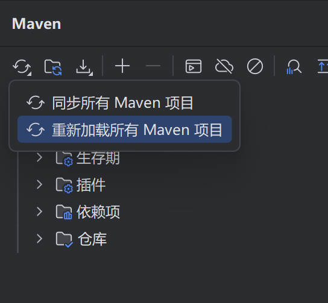
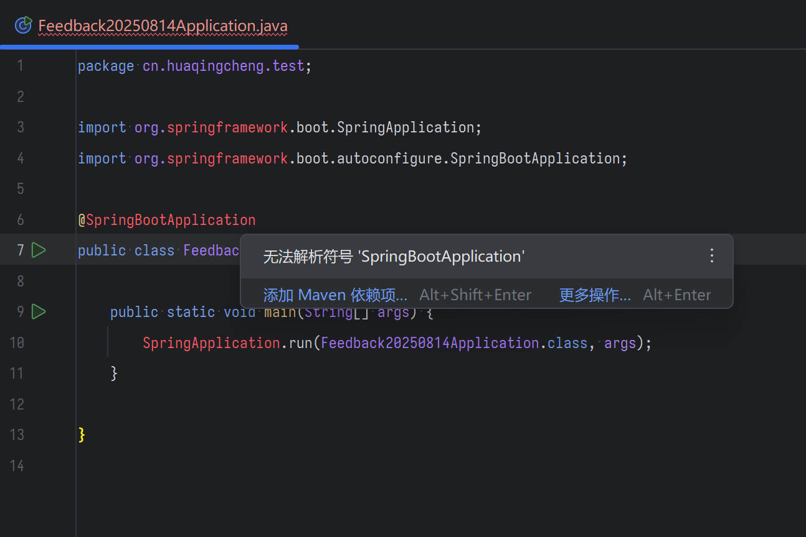

# 问题

`IDEA 2025.2` 重新打开项目时丢失项目信息, 报告 maven 依赖不存在   
这个问题是从 `IDEA 2025.1` 升级后新出现的

# 复现步骤

1. 新建任意一个 maven 项目, 打开项目刷新依赖至一切正常   
   
2. 关闭项目 或 完全退出 IDEA
3. 重新打开项目后稍等, IDEA 提示无法解析依赖项中的类型   
   

# 环境

- IntelliJ IDEA 2025.2 (Ultimate Edition) Build #IU-252.23892.409, built on August 1, 2025
- Runtime version: 21.0.7+6-b1038.58 amd64 (JCEF 122.1.9)
- Windows 11.0
- 使用本地安装的 `apache-maven-3.9.9`

```log
IntelliJ IDEA 2025.2 (Ultimate Edition)
Build #IU-252.23892.409, built on August 1, 2025
Source revision: 0a9a69b3f9332
Runtime version: 21.0.7+6-b1038.58 amd64 (JCEF 122.1.9)
VM: OpenJDK 64-Bit Server VM by JetBrains s.r.o.
Toolkit: sun.awt.windows.WToolkit
Windows 11.0
GC: G1 Young Generation, G1 Concurrent GC, G1 Old Generation
Memory: 8192M
Cores: 24
Registry:
  vcs.log.index.enable=true
  ide.experimental.ui=true
  jvm.dfa.analysis.ui.security.analysis.window.was.shown=true
Non-Bundled Plugins:
  JavaScriptDebugger (252.23892.515)
  org.jetbrains.completion.full.line (252.23892.458)
  com.intellij.notebooks.core (252.23892.464)
  com.jetbrains.plugins.ini4idea (252.23892.449)
  org.jetbrains.intellij.scripting-javascript (1.3)
  ru.adelf.idea.dotenv (252.23892.201)
  com.intellij.copyright (252.23892.464)
  org.editorconfig.editorconfigjetbrains (252.23892.464)
  org.jetbrains.plugins.yaml (252.23892.464)
  PythonCore (252.23892.458)
  org.toml.lang (252.23892.464)
  org.jetbrains.plugins.go-template (252.23892.201)
  com.intellij.kubernetes (252.23892.515)
  com.intellij.jvm.dfa.analysis (252.23892.409)
  com.intellij.properties (252.23892.464)
  com.intellij.velocity (252.23892.464)
  dev.meanmail.plugin.nginx-intellij-plugin (2025.17)
  com.intellij.spring.debugger (252.23892.360)
  com.intellij.spring (252.23892.458)
  String Manipulation (9.16.0)
  SequenceDiagram (4.0.5)
  com.intellij.swagger (252.23892.464)
  com.jetbrains.restClient (252.23892.464)
  com.github.camork.fileExpander (2.5)
  Pythonid (252.23892.458)
  com.intellij.plugin.adernov.powershell (2.11.0)
  intellij.jupyter (252.23892.464)
  GrepConsole (13.3.0-IJ2023.3)
  Docker (252.23892.515)
  com.bruce.intellijplugin.generatesetter (2.8.4)
  vanstudio.sequence.java (4.0.5)
  org.mapstruct.intellij (1.9.0)
  com.nasller.CodeGlancePro (1.9.8)
  com.apifox.uploader (2.0.14-243)
  JavaScript (252.23892.515)
  com.alibabacloud.intellij.cosy (2.5.16)
  com.github.aleksandrsl.intellijbrowserslist (1.0.2)
  com.intellij.react (252.23892.515)
  intellij.javascript.bun (252.23892.298)
  org.jetbrains.plugins.vue (252.23892.449)
  Karma (252.25204.0)
  mobi.hsz.idea.gitignore (4.5.6)
  com.intellij.bigdatatools.core (252.23892.458)
  com.intellij.bigdatatools.binary.files (252.23892.360)
  com.intellij.bigdatatools.rfs (252.23892.458)
  org.jetbrains.security.package-checker (252.23892.464)
  com.intellij.bigdatatools.kafka (252.23892.360)
  com.ccnode.codegenerator.MyBatisCodeHelperPro (3.4.5+2321)
  cn.yiiguxing.plugin.translate (3.7.3)
  com.intellij.microservices.ui (252.23892.464)
  zielu.gittoolbox (600.1.7+243)
Kotlin: 252.23892.409-IJ
```
